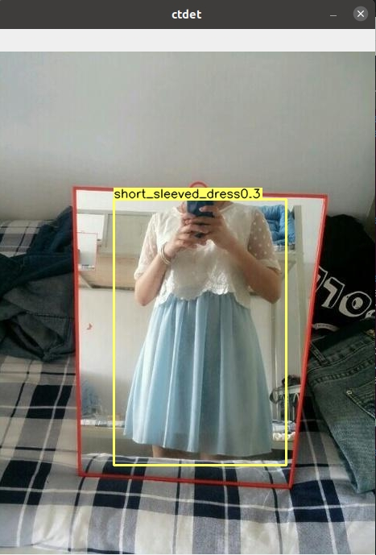
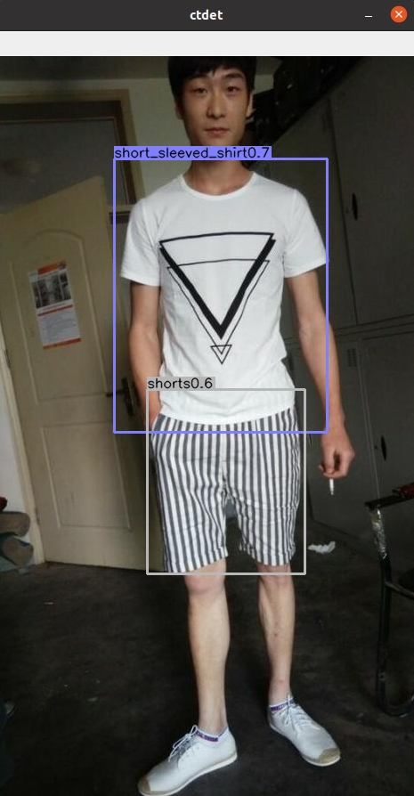
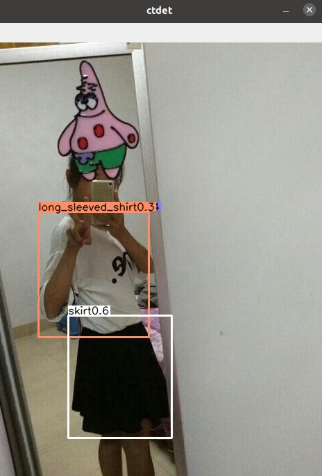

# Objects as Points with [MobileNetV2](https://arxiv.org/abs/1801.04381) backbone, training on [DeefFashion2](https://github.com/switchablenorms/DeepFashion2) dataset.

## What was done
1. Data set preparation.
- The DeefFashion2 data set uses the following structure: 3 folders test, train, val with images and annotations for each image. To feed the annotations to the CenterNet, we convert the annotations for each image into one file.
- In src/lib/datasets/dataset. We create a new file "dfashion.py" for our dataset, and change the contents of the file to our own, according to the coco.py in the folder. 

     Change the COCO class to our own name.  
     
     Replace num_classes=80 on line 14 with the number of my own categories (In DeepFashion2 13 categories).   
     
     Mean and standard value are changed to the mean and std of my own image dataset. I didn’t calculate their values myself, but I googled which ones          they use.    
     
     Change the paths to folders with annotations and images.  
     
     Change the category names and category IDs to your own.  
- In src/lib/datasets/dataset_factory.
     Adding your own dataset name to the dataset_fact dictionary.
- Edit the file src/lib/utils/debugger.py. Add support for the data set, and indicate the names of the categories.
     
2. Arch preparation.
- Add a file with a MobileNetv2 model to the network folder /src/lib/models.
- Add architecture to model_factory.py in /src/lib/models/model.py

3. Edit /src/lib/opts.py
- The first step is to set your own dataset as the default dataset and add it to the help.
- Change the default dataset used by the ctdet task to the newly added dataset (change resolution, number of categories, mean, std, dataset name).
- Set MobileNetv2 architecture as default.

4. Training. 
>python main.py ctdet --exp_id dfsh_mbnv2 --batch_size 12 --lr 1.25e-4 --dataset dfashion --arch mbnv2 

Trained as much as I could (41 epochs).  

For training, I had to truncate the training dataset so that the annotations json file were loaded into my computer's memory.  
Logs for training is provided [here](exp/ctdet/dfsh_mbnv2/logs_2022-03-28-19-35/log.txt) and [opts](exp/ctdet/dfsh_mbnv2/logs_2022-03-28-19-35/opt.txt).

5. Test.
>python test.py ctdet --exp_id dfsh_mbnv2 --keep_res --load_model ../exp/ctdet/dfsh_mbnv2/model_best.pth --dataset dfashion --arch mbnv2

| Average Precision  (AP)  | IoU=0.50:0.95 | area=   all   | maxDets=100  = 0.199 |  
| Average Precision  (AP)  | IoU=0.50 -----| area=   all   | maxDets=100  = 0.283 |  
| Average Precision  (AP)  | IoU=0.75 -----| area=   all   | maxDets=100  = 0.229 |  
| Average Precision  (AP)  | IoU=0.50:0.95 | area= small   | maxDets=100  = 0.000 |  
| Average Precision  (AP)  | IoU=0.50:0.95 | area=medium   | maxDets=100  = 0.280 |  
| Average Precision  (AP)  | IoU=0.50:0.95 | area= large   | maxDets=100  = 0.199 |  

| Average Recall     (AR)  | IoU=0.50:0.95 | area=   all | maxDets=  1  = 0.610 |  
| Average Recall     (AR)  | IoU=0.50:0.95 | area=   all | maxDets= 10  = 0.691 |  
| Average Recall     (AR)  | IoU=0.50:0.95 | area=   all | maxDets=100  = 0.699 |  
| Average Recall     (AR)  | IoU=0.50:0.95 | area= small | maxDets=100  = 0.025 |  
| Average Recall     (AR)  | IoU=0.50:0.95 | area=medium | maxDets=100  = 0.546 |  
| Average Recall     (AR)  | IoU=0.50:0.95 | area= large | maxDets=100  = 0.701 |  

After training, the network turned out to be silly, but it can still find some objects.

## Some results for inference:

  
  
  

     
